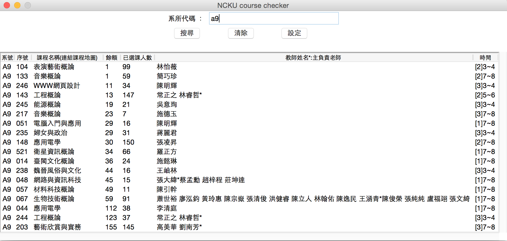
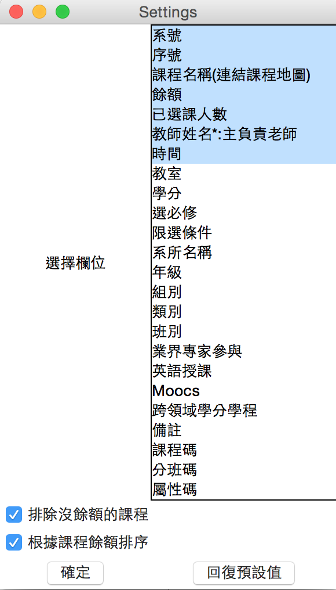
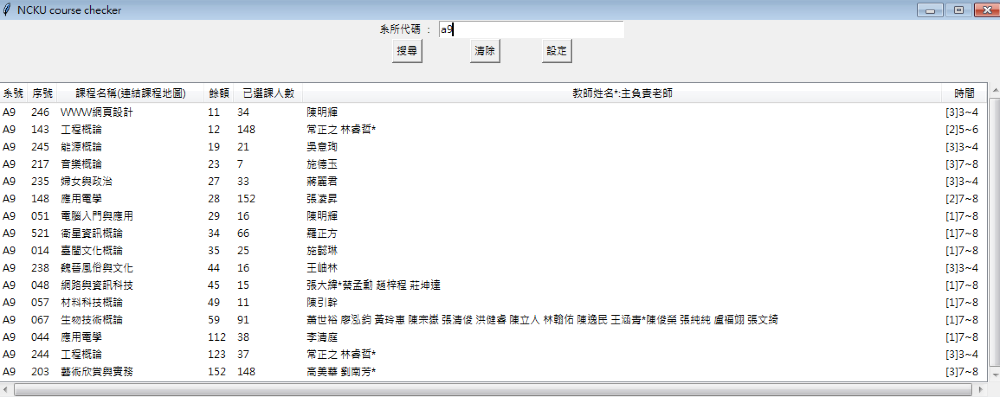
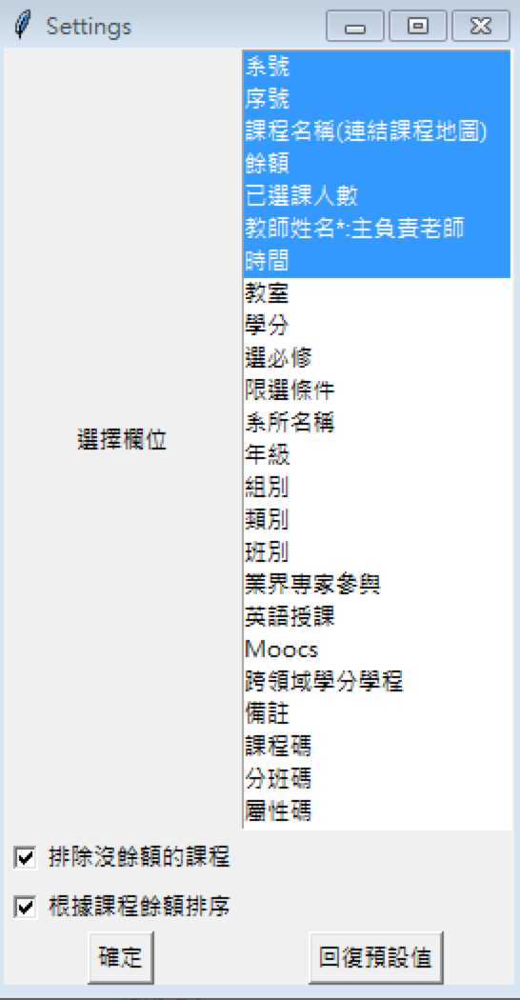
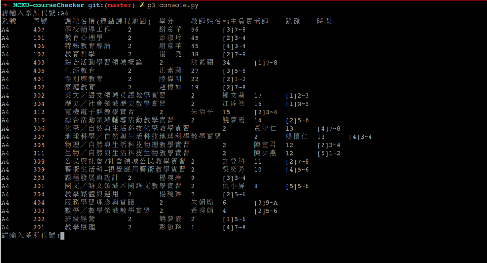

# NCKUcourseChecker.py
Checking whether there is any course in particular department that still has quota (for NCKU only)

# Requirement
- python3

- tkinter
For Ubuntu user
> sudo apt-get install python3-tk

- requests
> pip3 install -r requirements.txt


# USAGE
You can get the executable file from [main page](http://lee-w.github.io/NCKU-course-checker/)
, [build executeable file youself](#exe) or run it through python3 interpreter as below.


## GUI
```shell
python3 GUI.py
```

## Console
```shell
python3 console.py
```

<a name="exe"></a>
# Build Executeable File
Here I provide three setup file for different method to freeze this script.  
Note that you would need to setup the packages needed for freezing.

## cx_freeze

### Gerneral
```shell
python3 setup.py build
```

### For mac
```shell
python3 setup.py bdist_mac
```

after that you will find executable file under folder `build`

## py2exe
It can only be used under Windows.
```shell
python3 setup-py2exe.py build
python3 setup-py2exe.py py2exe
```

after that you will find executable file under folder `dist`

## py2app
It can only be used under Mac OSX.
```shell
python3 setup-py2app.py py2app
```

after that you will find executable file under folder `dist`


# Screen shot
## GUI
### Mac



### Windows



## Console



# AUTHORS
[Lee-W](https://github.com/Lee-W/)
