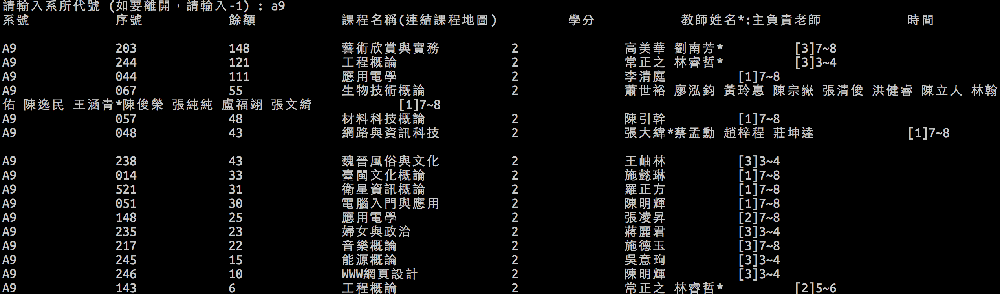

#NCKUcourseChecker.py
#DESCRIPTION
Checking whether there is any course in particular department that still has quota (for NCKU only)


#What you need before using it
- python3

- tkinter
> sudo apt-get install python3-tk


#USAGE

##GUI
```shell
python3 GUI.py
```
and then input the deparment number

##Console
```shell
python3 console.py
```
and then input the deparment number


#Screen shot
##GUI


##Console



#Issus


#AUTHORS
[Lee-W](https://github.com/Lee-W/)
